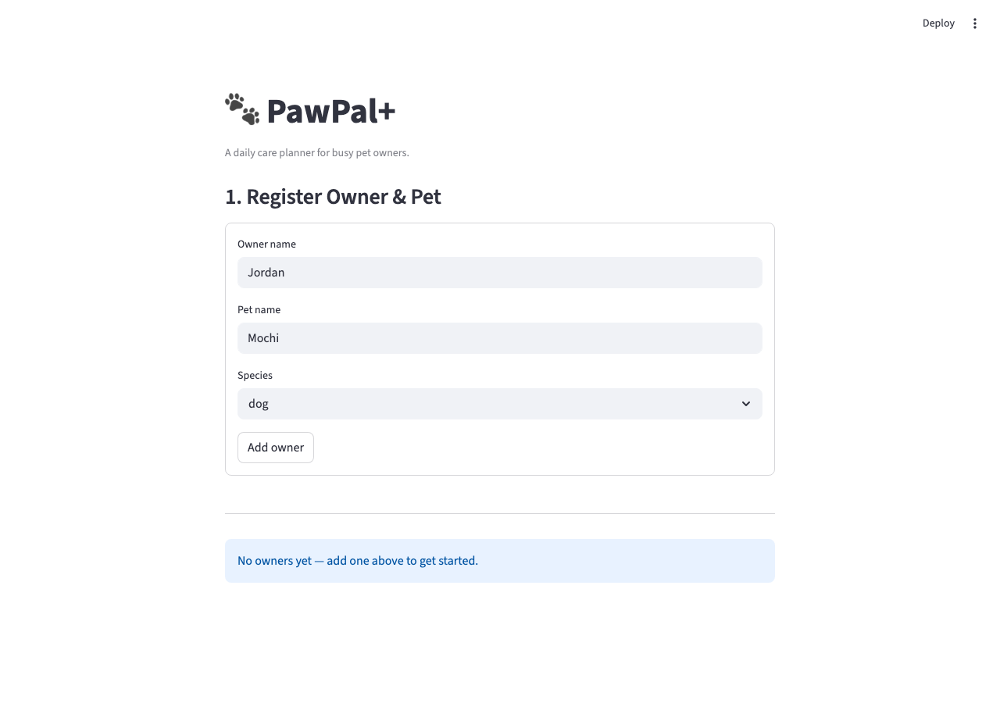

# PawPal+ (Module 2 Project)

A Streamlit app that helps a pet owner plan and schedule daily care tasks for their pet.



---

## Features

| Feature | Description |
|---|---|
| **Owner & Pet Registration** | Register an owner with a pet name and species; multiple owners supported in one session. |
| **Task Management** | Add tasks with title, duration, priority (high / medium / low), optional start time, and recurrence frequency. |
| **Chronological Sorting** | View tasks sorted by start time (`get_schedule_by_time()`); tasks with no time set appear last. |
| **Priority Sorting** | Sort by priority (high → medium → low) with alphabetical title tie-breaking. |
| **Status Filtering** | Toggle between Pending, Completed, and All task views. |
| **Conflict Detection** | Persistent `st.warning` banners flag any double-booked time slots, naming the specific tasks and offering a resolution hint. |
| **Recurring Tasks** | Completing a daily or weekly task automatically schedules the next occurrence; one-off tasks are not rescheduled. |
| **Daily Plan Generator** | Greedy planner selects the highest-priority tasks that fit within your available time budget. |
| **Plan Display** | Each planned task renders as a bordered card showing priority badge, time, and duration. |
| **UML Class Diagram** | See `uml_final.png` for the full class diagram (Owner, Pet, Task, Schedule). |

---

## Scenario

A busy pet owner needs help staying consistent with pet care. They want an assistant that can:

- Track pet care tasks (walks, feeding, meds, enrichment, grooming, etc.)
- Consider constraints (time available, priority, owner preferences)
- Produce a daily plan and explain why it chose that plan

Your job is to design the system first (UML), then implement the logic in Python, then connect it to the Streamlit UI.

## What you will build

Your final app should:

- Let a user enter basic owner + pet info
- Let a user add/edit tasks (duration + priority at minimum)
- Generate a daily schedule/plan based on constraints and priorities
- Display the plan clearly (and ideally explain the reasoning)
- Include tests for the most important scheduling behaviors

## Smarter Scheduling

The `Schedule` class was extended with four algorithmic improvements:

**Sort by time** — `get_schedule_by_time(status)` returns tasks ordered chronologically by their `HH:MM` start time. Tasks with no time set are pushed to the end. Accepts the same `status` filter as `get_schedule()`.

**Filter by status** — `get_schedule(status)` now accepts `"pending"` (default), `"completed"`, or `"all"`, replacing the previous hard-coded pending-only filter. `get_tasks_for_pet()` and `get_tasks_by_priority()` expose the same parameter.

**Automatic recurring tasks** — `complete_task()` checks the completed task's `frequency`. For `"daily"` tasks it creates a new occurrence due tomorrow (`timedelta(days=1)`); for `"weekly"` tasks it schedules one seven days out (`timedelta(weeks=1)`). Monthly and one-off tasks are not auto-rescheduled.

**Conflict detection** — `add_task()` prints a live warning whenever a new task lands on an already-occupied time slot. `get_conflicts()` returns a dict of every double-booked slot, and `warn_conflicts()` formats those into plain warning strings. Detection is exact start-time matching — a deliberate tradeoff documented in `reflection.md`.

---

## Getting started

### Setup

```bash
python -m venv .venv
source .venv/bin/activate  # Windows: .venv\Scripts\activate
pip install -r requirements.txt
```

### Suggested workflow

1. Read the scenario carefully and identify requirements and edge cases.
2. Draft a UML diagram (classes, attributes, methods, relationships).
3. Convert UML into Python class stubs (no logic yet).
4. Implement scheduling logic in small increments.
5. Add tests to verify key behaviors.
6. Connect your logic to the Streamlit UI in `app.py`.
7. Refine UML so it matches what you actually built.
